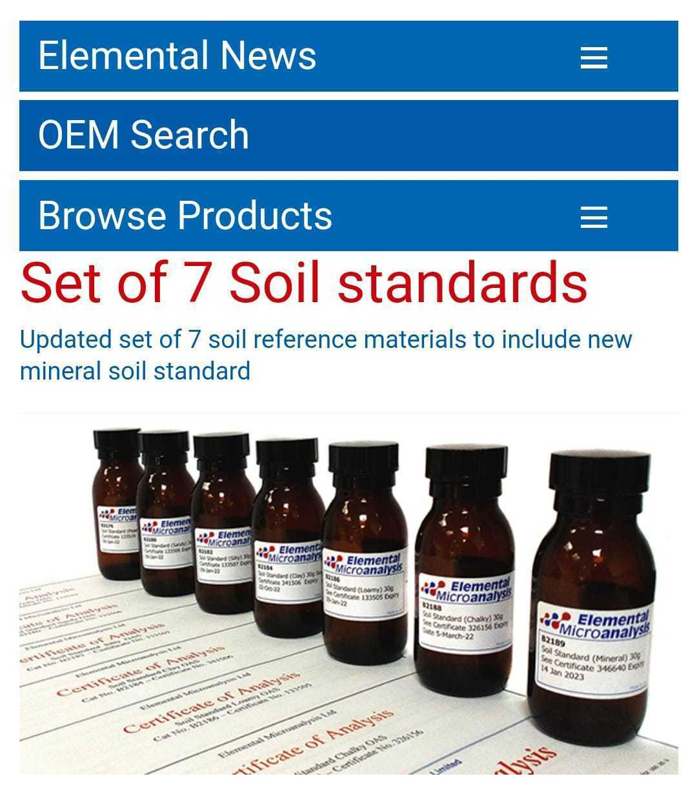

This note goes through a converstion I had with Cristo regarding the lab results from the preliminary maguey and carbon samples.
## Summary

- Soil and plant samples may have residual humidity, -which isn't generally quantified by labs- and affect final carbon content (underestimate).

- Their method which is unpublished yet -and about to test against carbon standards-, accounts for this. Cristo thinks it would be the most cost effective method for plant tissue.

## Conversation
Cristo started with this:
>[9:47 a. m., 21/12/2021] +52 1 871 173 3702: Si me permites un comentario, los primeros datos (preliminares) están realizados con nuestra técnica adaptada, misma que hacemos para el fraccionamiento de carbono, tambien es mucho mas económica al menos 5 o 6 veces mas económica y en precio por cantidad podríamos dar incluso un mejor precio. Las plantas están realizadas por calcinación y las diferencias observadas, pueden atribuirse a una no compensación de la humedad, que es algo que habitualmente no se hace en los análisis con LECO., comento esto porque a nosotros no lograron surtir el oxigeno, tuvimos que apoyarnos con la Universidad de Chihuahua, para el análisis de estas muestras por Dumas

>[9:56 a. m., 21/12/2021] Daniel Picasso: tendrías el protocolo de la técnica adaptada y dumas para compararlas?

>[10:06 a. m., 21/12/2021] +52 1 871 173 3702: Aún trabajamos con la publicación... Espero tenerla lista a mediados de año...

>[3:05 p. m., 22/12/2021] +52 1 871 173 3702: Cuando se muelen las muestras y se dejan para su análisis... Al final captan entre un 5 a 10 % de humedad de ambiente... Es decir si se tomarán 1g para analizar y la muestras trae una humedad del 10%, de muestra seca realmente trae 0.9g

>[3:06 p. m., 22/12/2021] +52 1 871 173 3702: Cuando en el leco o flash, se da de alta el peso para el cálculo uno asume que es 1g.

>[3:07 p. m., 22/12/2021] +52 1 871 173 3702: El secar las muestras antes de pesar es una práctica que muy pocos laboratorios hacen

>[3:07 p. m., 22/12/2021] +52 1 871 173 3702: Por eso el carbono de las plantas por leco sale más bajo

>[3:07 p. m., 22/12/2021] +52 1 871 173 3702: Observando la planta 1
>[3:07 p. m., 22/12/2021] Daniel Picasso: entonces se podría decir que hay una subestimación del carbono como del 10% tanto para suelo como para  tejido vegetal?

>[3:08 p. m., 22/12/2021] +52 1 871 173 3702: El suelo dependiendo del tipo pueden tomar hasta 5% de humedad...

>[3:10 p. m., 22/12/2021] +52 1 871 173 3702: La planta 1 trae aprox 40% de carbón... Si multiplicas 40*1.06 para compensar el 6%de humedad te da 42.4...

>[3:10 p. m., 22/12/2021] +52 1 871 173 3702: Sube...
[3:11 p. m., 22/12/2021] +52 1 871 173 3702: Sin afán de vender, nuestro servicio, sino como consejo... Por calcinación salen los tres datos... Materia orgánica, sólidos minerales y humedad...

>[3:12 p. m., 22/12/2021] +52 1 871 173 3702: Y medir sólidos minerales es una forma indirecta de evaluar también la cantidad de carbón...

>[3:12 p. m., 22/12/2021] +52 1 871 173 3702: Es decir entre menos sólidos minerales debe traer mayor material orgánico...

>[3:14 p. m., 22/12/2021] Daniel Picasso: permiteme tomar la muestra de tejido vegetal 1

>[3:15 p. m., 22/12/2021] Daniel Picasso: repitiendo tus pasos para verificar

>[3:15 p. m., 22/12/2021] Daniel Picasso: es la de penca americana

>[3:15 p. m., 22/12/2021] +52 1 871 173 3702: Y como les comentaba a porcentajes tan altos como en el caso de las plantas... Medir carbono por leco es una herramienta muy fina para algo muy robusto...

>[3:18 p. m., 22/12/2021] Daniel Picasso: el resultado preliminar son: la primera columna (carbón orgánico), materia orgánica, humedad  y minerales

>[3:19 p. m., 22/12/2021] +52 1 871 173 3702: Si

>[3:19 p. m., 22/12/2021] Daniel Picasso: carbon organico %, sería respecto a la materia absolutamente seca, compensando por humedad

>[3:20 p. m., 22/12/2021] +52 1 871 173 3702: Es la diferencia entre la materia seca y las cenizas

>[3:20 p. m., 22/12/2021] Daniel Picasso: mientras que el resultado de Leco, por motivos del oxígeno, se realizó en la universidad de Durango, donde es probable, si no es que seguro, que no secaron la muestra antes de realizar el análisis

>[3:20 p. m., 22/12/2021] +52 1 871 173 3702: Asumiendo que la materia orgánica se consume en la calcinación...

>[3:20 p. m., 22/12/2021] +52 1 871 173 3702: En Chihuahua
>[3:20 p. m., 22/12/2021] +52 1 871 173 3702: Si así es...

>[3:25 p. m., 22/12/2021] Daniel Picasso: haciendo la cuenta de 40.95*1/(1-0.0604) para compensar por la humedad remanente a materia absolutamente seca da 43.58, que está cerca de los 44.07 del preliminar

>[3:42 p. m., 22/12/2021] +52 1 871 173 3702: Así es

>[4:01 p. m., 22/12/2021] Daniel Picasso: Listo

>[4:14 p. m., 22/12/2021] Daniel Picasso: adicionalmente quisiera preguntarte, el secado se hace cerca de los 70°C, cierto?

>[4:15 p. m., 22/12/2021] +52 1 871 173 3702: 75

>[4:15 p. m., 22/12/2021] Daniel Picasso: no llega a los 100°C en caso de tejido vegetal

>[4:15 p. m., 22/12/2021] Daniel Picasso: correcto

>[4:15 p. m., 22/12/2021] +52 1 871 173 3702: Si así es...

>[4:16 p. m., 22/12/2021] Daniel Picasso: a esa temperatura queda humedad remanente que no es detectada por el LEco, pero si por el método de los resultados preliminares

>[4:16 p. m., 22/12/2021] Daniel Picasso: que es la que se reporta
>[4:16 p. m., 22/12/2021] +52 1 871 173 3702: Así es...

>[4:17 p. m., 22/12/2021] Daniel Picasso: las muestras de tejido te debieron de haber llegado secas a 75°C, te quisera preguntar si les diste un secado adicional?

>[4:17 p. m., 22/12/2021] Daniel Picasso: *deshidratadas a 75°C

>[4:18 p. m., 22/12/2021] +52 1 871 173 3702: Se muelen y una vez molidas las vuelvo a colocar a 75 grados para su peso...

>[4:21 p. m., 22/12/2021] Daniel Picasso: el método preliminar está inedito por ahora, pero esperan publicarlo junio-julio de este año?

>[4:21 p. m., 22/12/2021] +52 1 871 173 3702: Si solo me falta validarlo con un na serie de estándares referenciados... De carbono...

>[4:22 p. m., 22/12/2021] +52 1 871 173 3702: Ahorita nuestros resultados están trazables a estándares LECO

>[4:25 p. m., 22/12/2021] +52 1 871 173 3702: Vamos a probar con estos:
